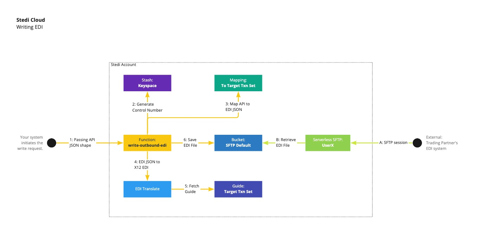

# Stedi Write EDI Demo

This repo contains an end-to-end demo for writing X12 EDI documents. This implementation demonstrates one possible way to interact with Stedi's APIs to achieve a typical EDI write workload; your implementation may include some or all of these products depending on your particular systems and requirements. 

The main orchestration point of this demo is a Stedi function called `write-outbound-edi`, which is written in [TypeScript](./src/functions/write/outbound-edi/handler.ts). For this workload, the function is the entry point and expected to be called along with a JSON payload that represents the source data that needs to be converted into the X12 EDI document.

As the illustration below shows, the `write-outbound-edi` function performs several steps:

1. Accepts a JSON payload of the source data.

2. Calls [Stash](https://www.stedi.com/docs/stash) to generate a control number for the EDI document.

3. Passes the incoming source JSON to [Mappings](https://www.stedi.com/docs/mappings) using a predefined Mapping. The Mapping converts the source data to a predefined [Guide](https://www.stedi.com/docs/guides) (which is a JSON Schema).

4. Combines the mapped result, control number & guide id before calling the EDI Translate API.

5. The [EDI Translate](https://www.stedi.com/docs/edi-translate) API retrieves the guide, validates that the input conforms to the guide schema, and generates the X12 EDI document.

6. The function finally saves the EDI string as a file in a [Bucket](https://www.stedi.com/docs/buckets) (for later retrieval via SFTP).



## Resource directories

Each subdirectory within the [resources](./src/resources) directory contains templates that can be used to create an EDI document for a specific transaction set from sample JSON input. Each template directory includes:
* `guide.json`: a [Guide](https://www.stedi.com/docs/guides) used to generate the EDI document
* `map.json`: a [Mapping](https://www.stedi.com/docs/mappings) that converts the sample JSON input to the schema of the Guide
* `input.json`: the sample JSON input to the workflow  
   Note, each `input.json` file MUST include a `transactionSet` property whose value matches the name of the directory in which it exists. For example:
  ```json 
  "transactionSet": "X12-850"
  ```
  The `transactionSet` attribute is used by the `write-outbound-edi` function to identify the appropriate guide and mapping to use.

## Prerequisites

1. [Node.js](https://docs.npmjs.com/downloading-and-installing-node-js-and-npm) _(`npm` version must be 7.x or greater)_

1. Clone this repo and install the necessary dependencies: 

   ```bash
   git clone https://github.com/Stedi-Demos/write-edi-demo.git
   cd write-edi-demo
   npm install
   ```

1. This project uses `dotenv` to manage the environmental variables required. You must create a `.env` file in the root directory of this repo and add two environment variables:
   * `STEDI_API_KEY`: Your Stedi API Key - used to deploy the function and internally to interact with product APIs. If you don't already have one, you can generate an [API Key here](https://www.stedi.com/app/settings/api-keys). 
   * `ENABLED_TRANSACTION_SETS`: a comma separated list of transaction sets that you would like to be able to generate EDI documents for. The values in the list MUST match available subdirectory names under the [resources](./src/resources) directory. The names are case sensitive.

   example `.env` file:
   ```
   STEDI_API_KEY=<REPLACE_ME>
   ENABLED_TRANSACTION_SETS=X12-850,X12-855
   ```
   
   The subsequent setup scripts will use the `ENABLED_TRANSACTION_SETS` environment variable to determine which resources to deploy to your account.

1. Create the EDI Guides by running:

   ```bash
   npm run create-guides
   ```
   
   For each guide that is created, an environment variable entry will automatically be added to the `.env` file. The output of the script will include a list of the environment variables that have been added:

   ```bash
   Updated .env file with 2 guide entries:

   X12_850_GUIDE_ID=01GEGDX8T2W6W2MTEAKGER7P3S
   X12_855_GUIDE_ID=01GEFFW2G33BCYDDKZ7H62T5Z5
   ```

1. Create the Mappings by running:

   ```bash
   npm run create-mappings
   ```

   For each mapping that is created, an environment variable entry will automatically be added to the `.env` file. The output of the script will include a list of the environment variables that have been added:
 
   ```bash
   Updated .env file with 2 mapping entries:

   X12_850_MAPPING_ID=01GEGCDRB3F1YQSENAWG9978Y7
   X12_855_MAPPING_ID=01GE0W06T3M0GS1V1AYYCK50HD
   ```

1. Create the Stash Keyspace to store control numbers:

   ```bash
   npm run create-keyspace
   ```

    The Stash Keyspace is used to generate (and increment) [control numbers](https://www.stedi.com/blog/control-numbers-in-x12-edi) to use when generating the EDI documents. 

1. Configure the Buckets (one for SFTP access and one for tracking function executions):

   ```bash
   npm run configure-buckets
   ```

   This will output environment variable entries for both the SFTP and Executions Buckets. Copy these entries to the `.env` file that you created earlier.
   For each bucket, an environment variable entry will automatically be added to the `.env` file. The output of the script will include a list of the environment variables that have been added:

   ```bash
   Updated .env file with 2 bucket entries:

   SFTP_BUCKET_NAME=4c22f54a-9ecf-41c8-b404-6a1f20674953-sftp
   EXECUTIONS_BUCKET_NAME=4c22f54a-9ecf-41c8-b404-6a1f20674953-executions
   ```

1. [Optional] Provision an SFTP user by visiting the [SFTP Web UI](https://www.stedi.com/app/sftp). This is optional, and is something you can always come back and do later. Creating an SFTP user will allow you to log in to retrieve the generated EDI documents via SFTP. When you do create a user, be sure to record the password (it will not be shown again).

## Setup & Deployment

This repo includes a basic deployment script to bundle and deploy the `write-outbound-edi` function to Stedi. To deploy you must complete the following steps:

1. Confirm that your `.env` file contains the necessary environment variables: 
   - `STEDI_API_KEY` 
   - `ENABLED_TRANSACTION_SETS` 
   - `SFTP_BUCKET_NAME`
   - `EXECUTIONS_BUCKET_NAME`
   - For each transaction set in the `ENABLED_TRANSACTION_SETS` list:
     - a `<TXN_SET>_GUIDE_ID` variable
     - a `<TXN_SET>_MAPPING_ID` variable

   It should look something like the following:

   ```
   STEDI_API_KEY=<YOUR_STEDI_API_KEY>
   ENABLED_TRANSACTION_SETS=X12-850,X12-855
   X12_850_GUIDE_ID=01GEGDX8T2W6W2MTEAKGER7P3S
   X12_855_GUIDE_ID=01GEFFW2G33BCYDDKZ7H62T5Z5
   X12_850_MAPPING_ID=01GEGCDRB3F1YQSENAWG9978Y7
   X12_855_MAPPING_ID=01GE0W06T3M0GS1V1AYYCK50HD
   SFTP_BUCKET_NAME=4c22f54a-9ecf-41c8-b404-6a1f20674953-sftp
   EXECUTIONS_BUCKET_NAME=4c22f54a-9ecf-41c8-b404-6a1f20674953-executions
   ```

1. To deploy the function:
   ```bash
   npm run deploy
   ```

   This should produce the following output:

   ```
   > stedi-write-edi-demo@1.1.0 deploy
   > ts-node ./src/setup/deploy.ts

   Deploying write-outbound-edi
   Done write-outbound-edi
   Deploy completed at: 9/14/2022, 08:48:43 PM
   ```
   
## Invoking the function

Once deployed, you may access the Function Web UI and perform the following steps.

1. In the [Functions List view](https://www.stedi.com/terminal/functions) you should see a function labelled `write-outbound-edi`, click on it's name to view its details.

1. Clicking on the `Edit environment variables` link will allow you to see the variables that were populated during the deploy step. The values will include the values from your `.env` file, as well as values from the `.resource_ids` files for the transaction sets that you included in the `ENABLED_TRANSACTION_SETS` list.

1. Click the `Edit execution payload` link, paste the contents of an `input.json` file for one of the [transaction sets](src/resources) that you included in the `ENABLED_TRANSACTION_SETS` list, and click save. 

1. Hit the `Execute` button, if successful the `Output` should look similar to the following (this example output was created using the [input](src/resources/X12-850/input.json) for the `X12-850` transaction set):

    ```json
    {
       "statusCode": 200,
       "bucketName": "4c22f54a-9ecf-41c8-b404-6a1f20674953-sftp",
       "key": "trading_partners/ANOTHERMERCH/outbound/000000001.edi",
       "body": "ISA*00*          *00*          *ZZ*AMERCHANT      *14*ANOTHERMERCH   *220915*0218*U*00501*000000001*0*T*>~GS*OW*WRITEDEMO*072271711TMS*20220915*021828*000000001*X*005010~ST*850*000000001~BEG*00*DS*365465413**20220830~REF*CO*ACME-4567~REF*ZZ*Thank you for your business~PER*OC*Marvin Acme*TE*973-555-1212*EM*marvin@acme.com~TD5****ZZ*FHD~N1*ST*Wile E Coyote*92*123~N3*111 Canyon Court~N4*Phoenix*AZ*85001*US~PO1*item-1*0008*EA*400**VC*VND1234567*SK*ACM/8900-400~PID*F****400 pound anvil~PO1*item-2*0004*EA*125**VC*VND000111222*SK*ACM/1100-001~PID*F****Detonator~CTT*2~AMT*TT*3700~SE*16*000000001~GE*1*000000001~IEA*1*000000001~"
    }
    ```

1. You can view the file using the [Buckets Web View](https://www.stedi.com/app/buckets). As shown above, the output of the function includes the `bucketName` and `key` (path within the bucket) of where the generated EDI was saved.

1. You may also connect using your preferred SFTP client and the user credentials provisioned earlier to retrieve the file.

1. You can also view the other resources that were created during setup in the UIs for the associated products:
   - [Guides Web UI](https://www.stedi.com/app/guides)
   - [Mappings Web UI](https://www.stedi.com/app/mappings)
   - [Stash Web UI](https://www.stedi.com/app/stash)


<!--
  TODO: add details about execution tracking logic

  ## Function execution tracking
-->
