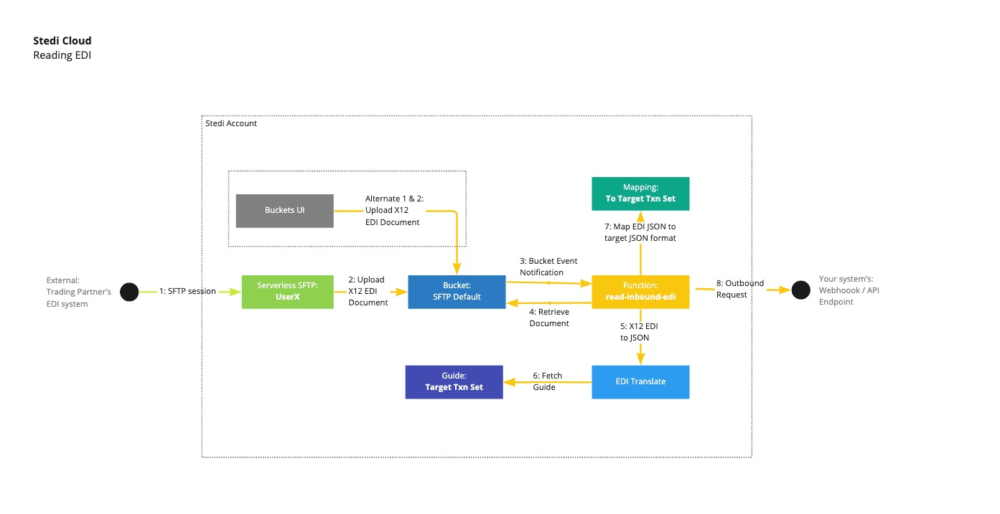

# Read EDI Demo
The main orchestration point of this demo is a Stedi function called `read-inbound-edi`, which is written in [TypeScript](./src/functions/read/inbound-edi/handler.ts). For this workload, the function is invoked when new items are uploaded to the [SFTP](https://www.stedi.com/docs/sftp)-enabled [Bucket](https://www.stedi.com/docs/bucket). The function processes X12 855 EDI documents that are uploaded to any directory named `inbound` within the bucket, converting it to a JSON payload that is sents to an external webhook.

As the illustration below shows, the `read-inbound-edi` function performs several steps:

1. Accepts a bucket notification event that is generated when files are written to the bucket.

2. Retrieves the contents of the uploaded file from the bucket

3. Calls the EDI Translate API, along with the guide id.

4. The EDI Translate API retrieves the guide, validates that the EDI contents conform to the guide spec, and converts the data to JSON that is formatted in the schema associated with the guide.

5. Passes the JSON output from the EDI Translate API to [Mappings](https://www.stedi.com/docs/mappings) using a predefined Map. The Map converts the JSON that was generated by the EDI Translate API to a custom JSON shape used by an external API.

6. Calls an external webhook with the JSON output from the mapped result as the payload.

7. The function finally deletes the uploaded file from the bucket after it has been processed.



## Invoking the function

Once deployed, the function will be invoked when files are written to the SFTP Bucket.

1. Using the [Buckets UI](https://www.stedi.com/app/buckets) navigate to the `inbound` directory for your trading partner: `/<SFTP_BUCKET_NAME>/trading_partners/ANOTHERMERCH/inbound`

2. Upload the [input X12 855 EDI](../../fixtures/read/input.edi) document to this directory (_note_: if you upload the document to the root directory `/`, it will be intentionally ignored by the `read-inbound-edi`).

3. Look for the output of the function wherever you created your test webhook! The function sends the JSON output of the mapping to the endpoint you have configured


JSON Mapping output:
```json
{
   "orderAcknowledgementDetails": {
      "internalOrderNumber": "ACME-4567",
      "orderNumber": "365465413",
      "orderDate": "2022-09-14",
      "orderAckDate": "2022-09-13"
   },
   "seller": {
      "name": "Marvin Acme",
      "address": {
         "street1": "123 Main Street",
         "city": "Fairfield",
         "state": "NJ",
         "zip": "07004",
         "country": "US"
      }
   },
   "shipTo": {
      "name": "Wile E Coyote",
      "address": {
         "street1": "111 Canyon Court",
         "city": "Phoenix",
         "state": "AZ",
         "zip": "85001",
         "country": "US"
      }
   },
   "items": [
      {
         "id": "item-1",
         "quantity": 8,
         "unitCode": "EA",
         "price": 400,
         "vendorPartNumber": "VND1234567",
         "sku": "ACM/8900-400",
         "status": "Accepted"
      },
      {
         "id": "item-2",
         "quantity": 4,
         "unitCode": "EA",
         "price": 125,
         "vendorPartNumber": "VND000111222",
         "sku": "ACM/1100-001",
         "status": "Accepted"
      }
   ]
}
```
4. [Optional -- Bonus / Extra Credit!] Create an SFTP user as described step 9. of the [Prerequisites](../../../README.md#Prerequisites). Next, using the SFTP client of your choice (the `sftp` command line client and [Cyberduck](https://cyberduck.io/) are popular options) connect to the SFTP service using the credentials for the SFTP user that you created. Once again, upload the [input X12 855 EDI](../../fixtures/read/input.edi) document to the `/inbound` directory and view the results!

